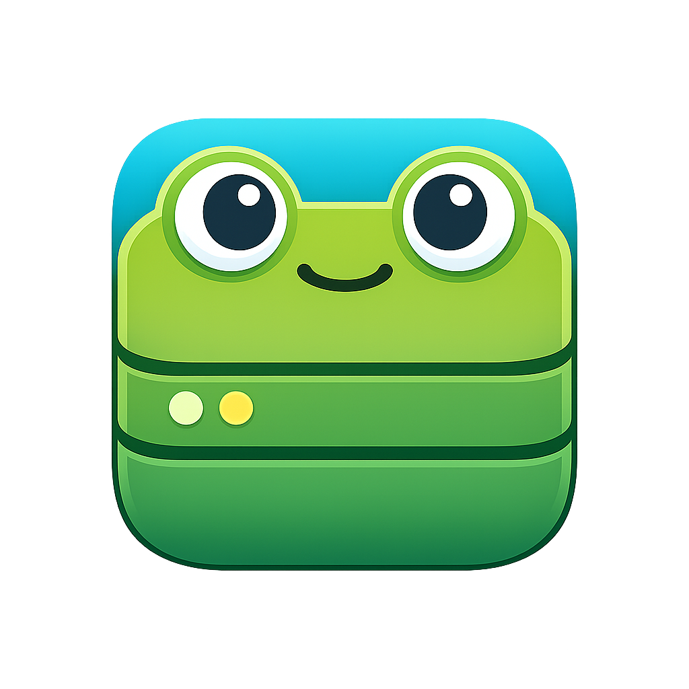

<p align="center">
  
</p>

<h3 align="center">A Redis 8.0-compatible, memory-first database built in Rust.</h3>

---

## What is FrogDB?

FrogDB is a memory-first database built in Rust with Tokio as the async engine (more on this below).
It is fully Redis wire protocol (RESP2 and RESP3) compatible so you can use it with any existing
Redis client. FrogDB aims to be faster, safer, and easier to operate than existing solutions while
supporting the full Redis 8 feature set, potentially adding additional features in the future.

## Goals

- **Correct** 
- **Fast** 
- **Scalable**
- **Easy to operate**

## Features

### Redis 8 Compatibility

Full RESP2/RESP3 wire protocol support with coverage across all Redis data structures:

- **Core types** — Strings, Lists, Sets, Sorted Sets, Hashes, Streams
- **Bitmaps & Bitfields** — BITCOUNT, BITOP, BITPOS, BITFIELD
- **JSON** — RedisJSON-compatible document storage with JSONPath
- **Time Series** — Gorilla-compressed time series with aggregation and downsampling
- **Vector Sets** — Approximate nearest-neighbor search
- **Probabilistic** — Bloom filters, Cuckoo filters, HyperLogLog, Count-Min Sketch, Top-K, T-Digest
- **Geospatial** — Geohash indexing and distance queries
- **Pub/Sub** — Channel and pattern-based publish/subscribe, event sourcing
- **Scripting & Transactions** — Lua scripting, MULTI/EXEC
- **Search** — Full text search, secondary indexing, vector search, aggregations, JSON documents

### Clustering & Replication

- Supports cluster operation with resizing and read replicas
- [Raft](https://raft.github.io/)-based consensus for cluster state coordination
- _TODO_: Automatic cluster rebalancing

### Additional Features

- Cross-slot operations allowed in single-node operation
  - MULTI/EXEC/MGET/etc
- Event sourcing (docs incoming)
- TBD

### Persistence

- WAL using [RocksDB](https://rocksdb.org/) for storage and replication
- Configurable durability modes (write-through or async)

### Operations

- Online configuration changes for many values
- _WIP_ Zero-downtime rolling upgrades
- [Prometheus](https://prometheus.io/) metrics/alarms
- [Grafana](https://grafana.com/) dashboard templates
- [OpenTelemetry](https://opentelemetry.io/) metrics, tracing, and logging
- HTTP debug pages
  - JSON API
  - Monitoring UI
  - Configuration
- [DTrace](https://dtrace.org/) probes
- _WIP_: Kubernetes support
- Tons of stats/logs and debugging information (all configurable)
- _WIP_: TLS support

### Testing

- Extensive unit and integration test suite
- [Shuttle](https://github.com/awslabs/shuttle) and [Turmoil](https://github.com/tokio-rs/turmoil)
  deterministic concurrency testing
- Redis regression compatibility suite
- Load testing and benchmarking
- Fuzz testing
- [Jepsen](https://jepsen.io/) verification using both
  [Knossos](https://github.com/jepsen-io/knossos) (linearizability) and
  [Elle](https://github.com/jepsen-io/elle) (serializability)

### CI

- [Self-hosted runner](.github/runner/) for running GitHub Actions locally via Docker

### Performance

- Profiling with custom causal profiler support
- _WIP_: Comparative benchmarking against Redis, Valkey, and Dragonfly
- _TODO_: io_uring/other runtimes like compio for faster I/O

## Quick Start

### Docker (fastest)

> **Note:** FrogDB is pre-release software — expect breaking changes.

```bash
# Stable release:
docker run -p 6379:6379 frogdb/frogdb:latest

# Bleeding-edge build from main:
docker run -p 6379:6379 ghcr.io/frogdb/frogdb:dev
```

Then connect with any Redis client:

```bash
redis-cli PING        # PONG
```

### From Source

#### Prerequisites

Language runtimes and dev CLI tools (Rust, Python, Node, `just`, `uv`, `bun`, cargo
plugins, etc.) are managed by [mise](https://mise.jdx.dev/) via `.mise.toml`. Run
`mise install` once to fetch everything pinned there. System libraries (libclang,
OpenSSL, Redis, Tcl for the Redis test suite, ...) still come from your OS package
manager via `Brewfile` / `shell.nix`.

**macOS:**
```bash
brew bundle            # system libs (llvm, redis, tcl-tk, leiningen, ...)
mise install           # rust, python, node, bun, just, uv, cargo tools, ...
lefthook install       # set up pre-commit hooks
```

**Nix (any platform):**
```bash
nix-shell              # system libs + mise
mise install           # language runtimes + CLI tools
lefthook install
```

**Debian/Ubuntu:**
```bash
sudo apt install build-essential pkg-config libclang-dev libssl-dev
curl https://mise.run | sh
mise install
lefthook install
```

**Arch Linux:**
```bash
sudo pacman -S base-devel clang openssl pkg-config mise
mise install
lefthook install
```

### Build & Run

```bash
just build            # debug build
just run              # start server on 127.0.0.1:6379
```

### Common Commands

```bash
just test                        # run all tests
just test frogdb-core            # test a specific crate
just test frogdb-core foo        # test matching a pattern
just lint                        # clippy
just fmt                         # format
just watch                       # watch mode type-checking
just                             # list all recipes
```

### Connect

It should work seamlessly with your standard Redis clients, including cluster commands.

```bash
redis-cli SET hello world
redis-cli GET hello   # "world"
```

## Documentation

Documentation lives on the [FrogDB website](https://frogdb.dev/), organized by audience:

| Audience     | Path                                              | Description                                                     |
| ------------ | ------------------------------------------------- | --------------------------------------------------------------- |
| Users        | [Guides](website/src/content/docs/guides/)               | Commands, scripting, pub/sub, event sourcing, transactions      |
| Operators    | [Operations](website/src/content/docs/operations/)       | Configuration, deployment, persistence, replication, monitoring |
| Contributors | [Architecture](website/src/content/docs/architecture/)   | Architecture, concurrency model, storage engine, VLL            |

## Contributing

Contributions are welcome! See the [architecture documentation](website/src/content/docs/architecture/) for
architecture guides and development setup.

## License

FrogDB is tri-licensed.

Choose whichever fits your use case:

| License        | Best for                                                                                                          |
| -------------- | ----------------------------------------------------------------------------------------------------------------- |
| **BSL-1.1**    | Most users — use freely, with a restriction on competing database products. Converts to Apache 2.0 after 2 years. |
| **AGPLv3**     | Users who need an OSI-approved copyleft license.                                                                  |
| **Commercial** | Organizations needing custom terms.                                                                               |

See [LICENSE.md](LICENSE.md) for full details.
