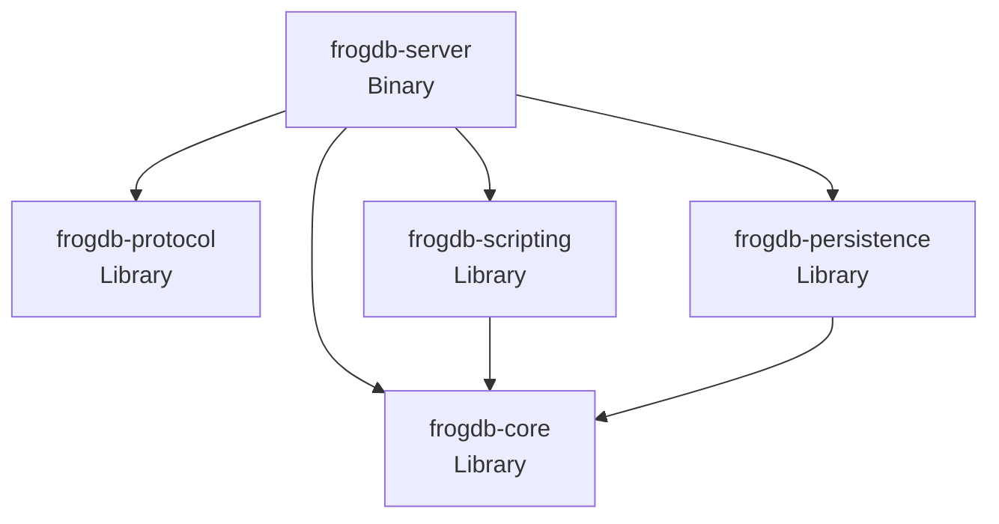
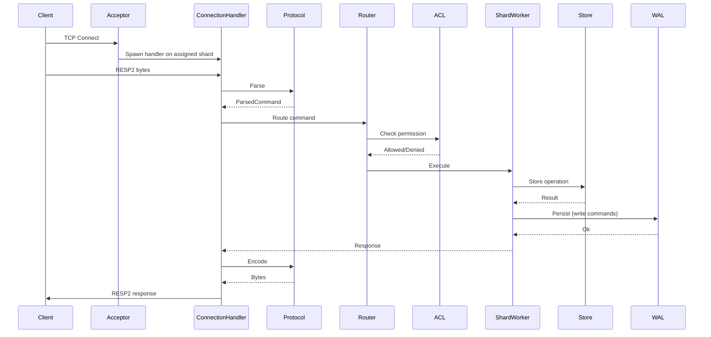
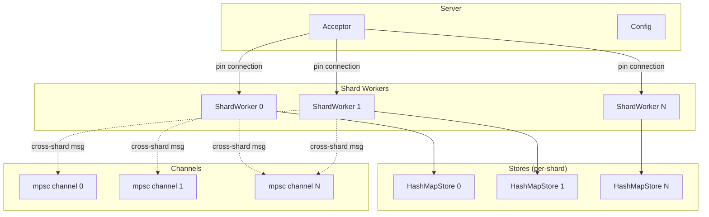
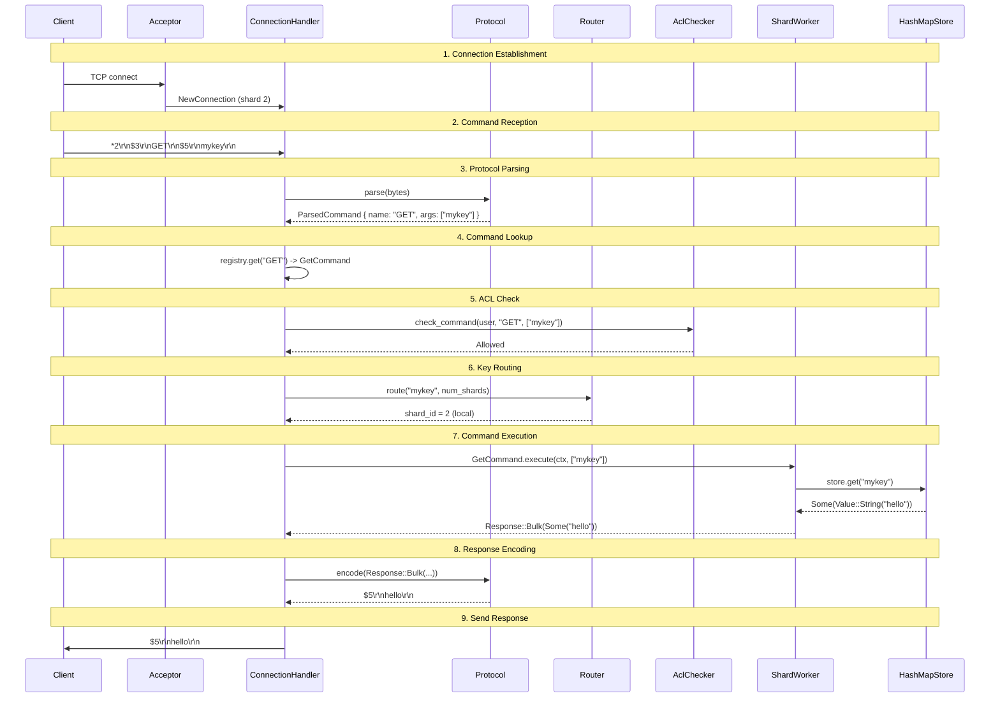

# FrogDB Architecture

System design, crate structure, and design principles for FrogDB contributors.

---

## Overview

FrogDB is a Redis-compatible in-memory database written in Rust. The architecture emphasizes:

- **Shared-nothing threading**: Each shard worker owns its data exclusively
- **Message-passing**: Cross-shard coordination via channels, no shared state
- **Pin-based connections**: Connections assigned to a single shard worker for their lifetime
- **Clean crate boundaries**: Separate concerns across well-defined crates

The architecture uses trait-based abstractions so that components (persistence, ACL, Lua scripting, etc.) can be swapped between stub and full implementations without refactoring.

---

## Design Principles

### Shared-Nothing Threading

Each shard worker is a Tokio task that owns:
- A partition of the keyspace (determined by key hashing)
- Its own `Store` instance
- All connections pinned to it

No locks are needed for data access because each shard has exclusive ownership of its data.

### Message-Passing Over Shared State

Shard workers communicate via `mpsc` channels:
- `ShardMessage` for cross-shard requests (see [concurrency.md](concurrency.md#message-types) for full enum definition)
- `NewConnection` for connection assignment from the acceptor

This eliminates lock contention and simplifies reasoning about concurrency.

### Channel Configuration

Shard channels are bounded to provide backpressure:

```rust
const SHARD_CHANNEL_CAPACITY: usize = 1024;
let (tx, rx) = mpsc::channel::<ShardMessage>(SHARD_CHANNEL_CAPACITY);
```

When a channel fills, the sending connection blocks until space is available. This propagates backpressure to clients and prevents memory exhaustion. See [concurrency.md](concurrency.md) for details.

### Pin-Based Connections

When a client connects:
1. The Acceptor assigns it to a shard worker (round-robin)
2. The connection remains pinned to that shard for its lifetime
3. Commands for keys on other shards are forwarded via message-passing

### Key Hashing

FrogDB uses two hash algorithms for different purposes:

| Purpose | Algorithm | Range | Reference |
|---------|-----------|-------|-----------|
| Internal shard routing | xxhash64 | `hash % num_shards` | [concurrency.md](concurrency.md#key-hashing) |
| Cluster slot assignment | CRC16 | `hash % 16384` | [storage.md](storage.md#hash-algorithms) |

Both use the same hash tag extraction logic (`{tag}` syntax) for colocation.

### Separation of Concerns

Each crate has a clear, bounded responsibility:
- **Protocol**: Wire format only (no command semantics)
- **Core**: Data structures and command logic (no I/O)
- **Server**: I/O, concurrency, orchestration
- **Lua**: Script execution (Lua VM pool, redis.call bindings)
- **Persistence**: Durability (WAL, RocksDB, snapshots)

---

## Crate Architecture

FrogDB is organized as a Cargo workspace with 26 crates. The core dependency graph:



### Workspace Layout

```
frogdb/
├── Cargo.toml                 # Workspace manifest (26 members)
├── Cargo.lock                 # Committed (binary project)
├── Justfile                   # Local dev commands (fmt, lint, test)
├── rust-toolchain.toml        # Pinned Rust version
├── .cargo/
│   └── config.toml            # Cargo settings, linker, sccache
├── frogdb-server/
│   ├── crates/                # All Rust crates
│   │   ├── server/            # Binary: networking, runtime, main()
│   │   ├── core/              # Core engine: Command trait, Store, shard worker
│   │   ├── commands/          # Data-structure command implementations
│   │   ├── protocol/          # RESP2/RESP3 wire protocol
│   │   ├── types/             # Shared value types and errors
│   │   ├── persistence/       # RocksDB storage, WAL, snapshots
│   │   ├── scripting/         # Lua scripting (Functions API)
│   │   ├── search/            # RediSearch-compatible full-text search
│   │   ├── acl/               # Redis 7.0 ACL system
│   │   ├── cluster/           # Raft-based cluster coordination
│   │   ├── replication/       # Primary-replica streaming
│   │   ├── vll/               # Very Lightweight Locking
│   │   ├── telemetry/         # Prometheus metrics, OpenTelemetry tracing
│   │   ├── debug/             # Debug web UI
│   │   ├── frogdb-macros/     # #[derive(Command)] proc macro
│   │   ├── metrics-derive/    # Typed metrics proc macro
│   │   ├── test-harness/      # TestServer, ClusterHarness
│   │   ├── testing/           # Consistency checker, test models
│   │   ├── redis-regression/  # Redis compat regression tests
│   │   ├── browser-tests/     # Browser integration tests
│   │   └── tokio-coz/         # Causal profiler for Tokio
│   ├── benchmarks/            # Criterion benchmarks
│   └── ops/                   # Operational tooling
│       ├── helm/helm-gen/     # Helm chart generator
│       └── grafana/dashboard-gen/  # Grafana dashboard generator
├── docs/
│   ├── contributors/          # Contributor documentation
│   ├── operators/             # Operator documentation
│   └── users/                 # User documentation
├── testing/
│   ├── jepsen/                # Jepsen distributed systems tests
│   ├── redis-compat/          # Redis TCL test suite runner
│   └── load-test/             # Load testing scripts
└── fuzz/                      # cargo-fuzz targets
```

### Crate Layers

| Layer | Crates | Role |
|-------|--------|------|
| **Server Binary** | `frogdb-server` | Networking, runtime, main() |
| **Commands & Observability** | `frogdb-commands`, `frogdb-telemetry`, `frogdb-debug` | Command impls, metrics, tracing |
| **Core Engine** | `frogdb-core` | Command trait, Store trait, shard worker |
| **Features** | `frogdb-acl`, `frogdb-scripting`, `frogdb-search`, `frogdb-replication`, `frogdb-cluster`, `frogdb-persistence`, `frogdb-vll` | Feature modules |
| **Foundation** | `frogdb-types`, `frogdb-protocol` | Value types, RESP protocol |
| **Macros** | `frogdb-macros`, `frogdb-metrics-derive` | Proc macros (no internal deps) |
| **Testing** | `frogdb-test-harness`, `frogdb-testing`, `frogdb-redis-regression`, `frogdb-browser-tests` | Test infrastructure |
| **Tooling** | `frogdb-benches`, `helm-gen`, `dashboard-gen`, `tokio-coz` | Benchmarks, ops tooling |

### frogdb-protocol

**Responsibility**: RESP2 wire protocol parsing and encoding.

| Aspect | Details |
|--------|---------|
| **Owns** | Frame parsing, Response encoding, Tokio codec |
| **Does NOT own** | Command semantics, execution logic |
| **Key types** | `ParsedCommand { name: Bytes, args: Vec<Bytes> }`, `Response`, `ProtocolVersion` |
| **Dependencies** | `bytes`, `redis-protocol`, `tokio-util` |

### frogdb-core

**Responsibility**: Data structures, command trait, and command implementations.

| Aspect | Details |
|--------|---------|
| **Owns** | `Store` trait, `Value` enum, `Command` trait, command implementations |
| **Does NOT own** | I/O, networking, concurrency primitives |
| **Key types** | `Store`, `HashMapStore`, `Value`, `Command`, `CommandRegistry`, `CommandError` |
| **Dependencies** | `bytes`, `griddle` |

### frogdb-scripting

**Responsibility**: Lua script execution within shards.

| Aspect | Details |
|--------|---------|
| **Owns** | Lua VM pool, `redis.call()` bindings, script caching |
| **Does NOT own** | Key routing (scripts must use hash tags for colocation) |
| **Key types** | `LuaVmPool`, `ScriptRegistry` |
| **Dependencies** | `frogdb-core`, `mlua` |

### frogdb-persistence

**Responsibility**: Durable storage via RocksDB.

| Aspect | Details |
|--------|---------|
| **Owns** | WAL writing, snapshot management, crash recovery |
| **Does NOT own** | In-memory storage (that's `frogdb-core`) |
| **Key types** | `WalWriter`, `SnapshotManager`, `RocksDbBackend` |
| **Dependencies** | `frogdb-core`, `rocksdb` |

### frogdb-server

**Responsibility**: Main server binary, I/O, and concurrency orchestration.

| Aspect | Details |
|--------|---------|
| **Owns** | TCP acceptor, shard workers, connection handling, routing, configuration |
| **Does NOT own** | Protocol parsing (delegates to `frogdb-protocol`), command logic (delegates to `frogdb-core`) |
| **Key types** | `Server`, `Acceptor`, `ShardWorker`, `ConnectionHandler`, `Config` |
| **Dependencies** | All other crates, `tokio`, `figment`, `clap`, `tracing` |

---

## Component Relationships

### Request Flow



Commands execute with access to `CommandContext`, which provides store access, connection state, and shard routing. See [execution.md](execution.md#commandcontext-definition) for the complete definition.

### Shard Architecture



### Key Component Interactions

| Interaction | Description |
|-------------|-------------|
| **Acceptor -> ShardWorker** | New connections sent via `NewConnection { socket, addr, conn_id }` struct |
| **ConnectionHandler -> Protocol** | Parsing and encoding via `frogdb-protocol` types |
| **ConnectionHandler -> Router** | Command routing based on key hashing |
| **Router -> ACL** | Permission check before execution (AllowAll when ACL disabled, full enforcement when enabled) |
| **ShardWorker -> Store** | Data operations via `Store` trait |
| **ShardWorker -> WAL** | Persistence hook for write commands (Async/Periodic/Sync modes) |
| **ShardWorker <-> ShardWorker** | Cross-shard requests via `mpsc` channels |

---

## Responsibility Boundaries

### Protocol Crate Boundary

```
+----------------------------------------------------------+
|                    frogdb-protocol                        |
+----------------------------------------------------------+
|  IN: Raw bytes from network                              |
|  OUT: ParsedCommand { name, args }                       |
|                                                          |
|  IN: Response enum                                       |
|  OUT: RESP2-encoded bytes                                |
+----------------------------------------------------------+
|  DOES NOT: Execute commands, access storage, route keys  |
+----------------------------------------------------------+
```

### Core Crate Boundary

```
+----------------------------------------------------------+
|                      frogdb-core                         |
+----------------------------------------------------------+
|  IN: Command name, args, CommandContext                   |
|  OUT: Response (success or error)                        |
|                                                          |
|  Store trait: get, set, delete, contains, scan           |
|  Command trait: name, arity, flags, execute, keys        |
+----------------------------------------------------------+
|  DOES NOT: Network I/O, async operations, routing        |
+----------------------------------------------------------+
```

### Server Crate Boundary

```
+----------------------------------------------------------+
|                     frogdb-server                         |
+----------------------------------------------------------+
|  OWNS:                                                   |
|    - TCP listener and connection lifecycle               |
|    - Shard worker tasks (one per core)                   |
|    - Key routing (hash slot -> internal shard)           |
|    - Configuration loading (Figment: CLI > env > TOML)   |
|    - Graceful shutdown                                   |
+----------------------------------------------------------+
|  DELEGATES TO:                                           |
|    - frogdb-protocol: parsing/encoding                   |
|    - frogdb-core: command execution                      |
|    - frogdb-persistence: durability (WAL, snapshots)     |
|    - frogdb-scripting: script execution (Lua VM)         |
+----------------------------------------------------------+
```

### Error Handling

Command errors are returned via `CommandError` enum. Key variants:
- `WrongArity` - Incorrect number of arguments
- `WrongType` - Operation on wrong value type
- `InvalidArgument` - Invalid argument format
- `OutOfMemory` - maxmemory limit reached

Key routing is implemented as functions within the server crate, not as a separate `Router` struct. The routing logic uses hash functions defined in [concurrency.md](concurrency.md#key-hashing).

### Trait Interfaces

Core traits that define component contracts:

#### AclChecker Trait

```rust
pub trait AclChecker: Send + Sync {
    fn check_command(&self, user: &AuthenticatedUser, command: &str, subcommand: Option<&str>) -> PermissionResult;
    fn check_key_access(&self, user: &AuthenticatedUser, key: &[u8], access_type: KeyAccessType) -> PermissionResult;
    fn check_channel_access(&self, user: &AuthenticatedUser, channel: &[u8]) -> PermissionResult;
}
```

#### WalWriter Trait

```rust
pub trait WalWriter: Send {
    fn write(&mut self, entry: &WalEntry) -> Result<(), PersistenceError>;
    fn flush(&mut self) -> Result<(), PersistenceError>;
    fn sync(&mut self) -> Result<(), PersistenceError>;
}
```

---

## Data Flow

### GET Command Walkthrough



### SET Command Walkthrough

For write commands, the persistence hook writes to the WAL:

```
1. Client sends: SET mykey hello
2. Protocol parses to ParsedCommand
3. ACL check: Allowed (or Denied if ACL configured)
4. Router: shard_id = hash("mykey") % num_shards
5. SetCommand.execute():
   a. store.set("mykey", Value::String("hello"))
   b. wal_writer.write(SetEntry { key, value })
      -> persisted per configured durability mode (Async/Periodic/Sync)
6. Response: +OK\r\n
```

### Cross-Shard Request Flow

When a command's key maps to a different shard:

```
1. Connection pinned to ShardWorker 0
2. Client sends: GET otherkey
3. Router: shard_id = 3 (remote)
4. ShardWorker 0 creates oneshot channel for response
5. ShardWorker 0 sends ShardMessage::Execute to ShardWorker 3
6. ShardWorker 3 executes, sends response via oneshot
7. ShardWorker 0 receives response, encodes, sends to client
```
