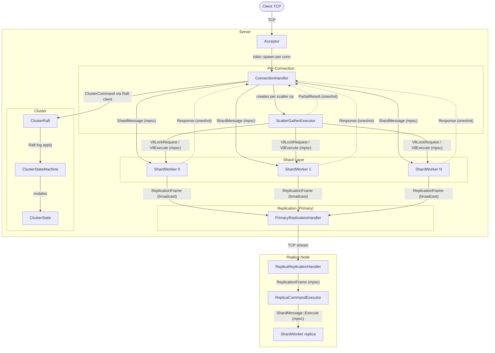
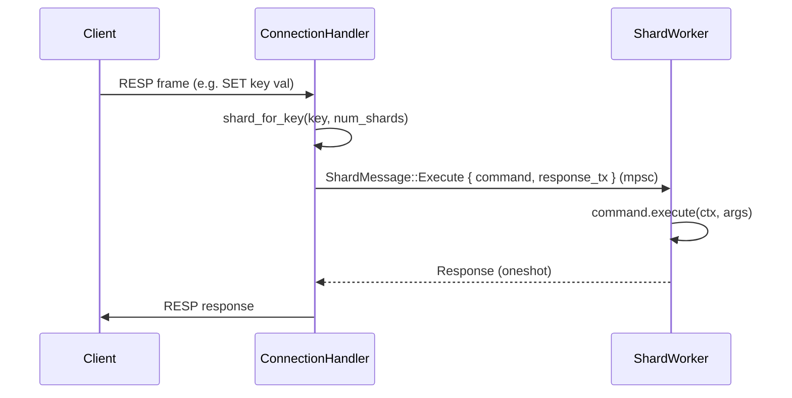
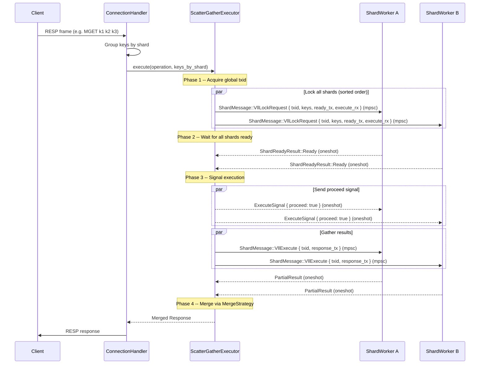
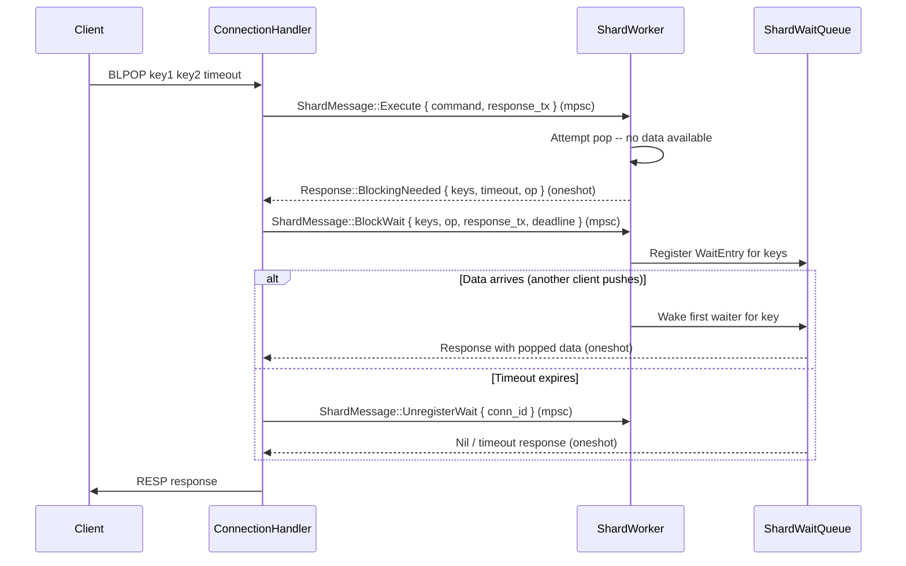
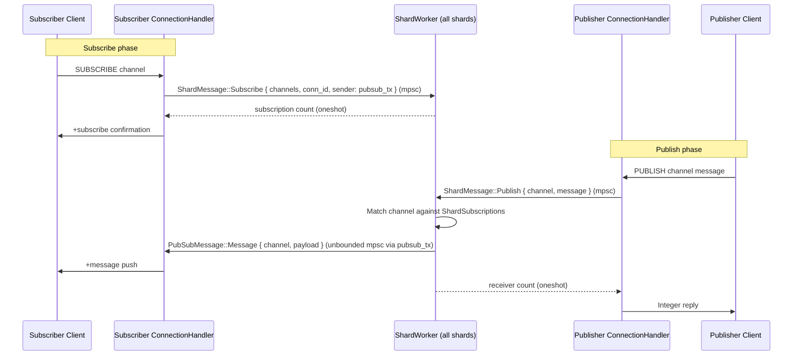
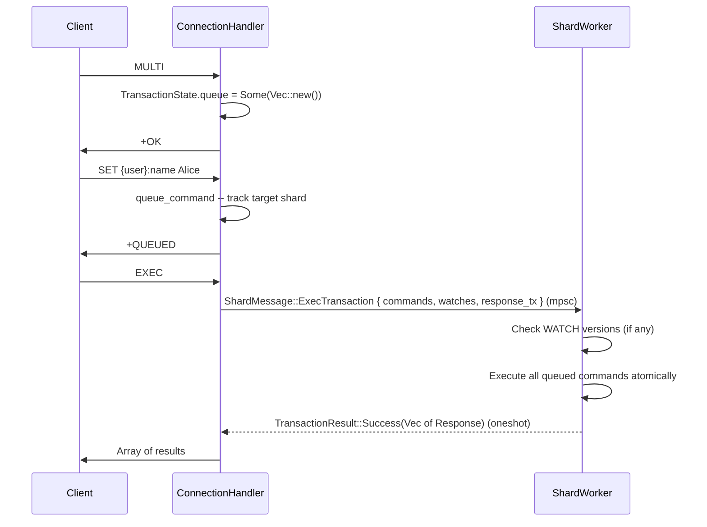
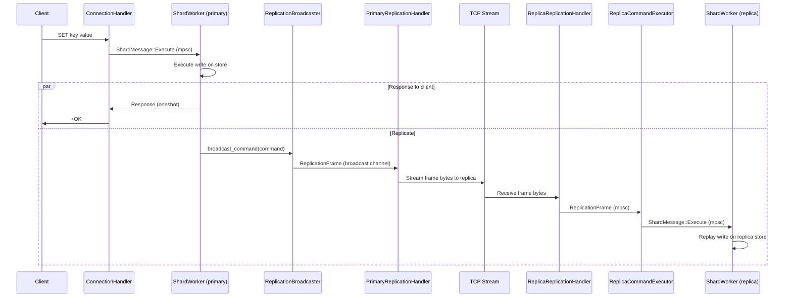
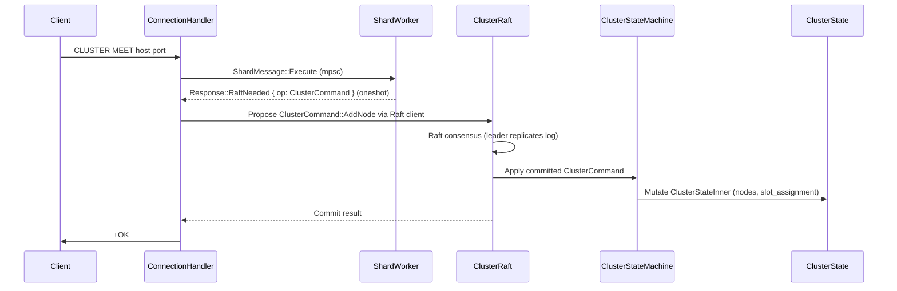

# FrogDB Request Flow Diagrams

High-level component-interaction diagrams showing how requests move between major architectural components.

**Key source files:**
- `crates/server/src/acceptor.rs` -- `Acceptor`
- `crates/server/src/connection.rs` -- `ConnectionHandler`
- `crates/core/src/shard.rs` -- `ShardWorker`, `ShardMessage`, `ScatterOp`
- `crates/server/src/scatter/executor.rs` -- `ScatterGatherExecutor`
- `crates/core/src/vll/` -- `IntentTable`, `TransactionQueue`, `ExecuteSignal`
- `crates/core/src/pubsub.rs` -- `PubSubMessage`, `ShardSubscriptions`
- `crates/server/src/replication/` -- `PrimaryReplicationHandler`, `ReplicaReplicationHandler`
- `crates/core/src/cluster/` -- `ClusterRaft`, `ClusterStateMachine`, `ClusterState`

---

## 1. System Architecture Overview

### Channel Summary

| From | To | Channel | Message |
|------|----|---------|---------|
| ConnectionHandler | ShardWorker | `mpsc::Sender<ShardMessage>` | `ShardMessage::*` |
| ShardWorker | ConnectionHandler | `oneshot::Sender<Response>` | `Response` |
| ScatterGatherExecutor | ShardWorker | `mpsc::Sender<ShardMessage>` | `VllLockRequest`, `VllExecute` |
| ShardWorker | ScatterGatherExecutor | `oneshot::Sender<ShardReadyResult>` | `ShardReadyResult::Ready` |
| ShardWorker | ConnectionHandler | `mpsc::UnboundedSender<PubSubMessage>` | `PubSubMessage::*` |
| ShardWorker | PrimaryReplicationHandler | `broadcast::Sender<ReplicationFrame>` | `ReplicationFrame` |
| ReplicaReplicationHandler | ReplicaCommandExecutor | `mpsc::Sender<ReplicationFrame>` | `ReplicationFrame` |
| ReplicaCommandExecutor | ShardWorker | `mpsc::Sender<ShardMessage>` | `ShardMessage::Execute` |

---

## 2. Single-Key Command (GET, SET, INCR, LPUSH, ...)

**Key routing:** `CRC16(key) mod 16384 -> slot`, then `slot mod num_shards -> shard_id`. Hash tags `{...}` override to use only the tag contents.

---

## 3. Scatter-Gather Command (MGET, MSET, DEL, EXISTS, ...)

**Merge strategies:** `OrderedArray` (MGET), `SumIntegers` (DEL/EXISTS), `AllOk` (MSET).

---

## 4. Blocking Command (BLPOP, BRPOP, BLMOVE, ...)

---

## 5. Pub/Sub (SUBSCRIBE, PUBLISH, SSUBSCRIBE, SPUBLISH)

**Sharded pub/sub** (`SSUBSCRIBE`/`SPUBLISH`) routes to a single shard via `shard_for_key(channel)` instead of broadcasting.

---

## 6. Transaction (MULTI / EXEC)

All keys in a transaction must hash to the same shard.

---

## 7. Replication (Primary -> Replica)

---

## 8. Cluster Consensus (Raft)

Read-only cluster commands (`CLUSTER INFO`, `CLUSTER NODES`, `CLUSTER SLOTS`) read directly from `ClusterState` without going through Raft.
