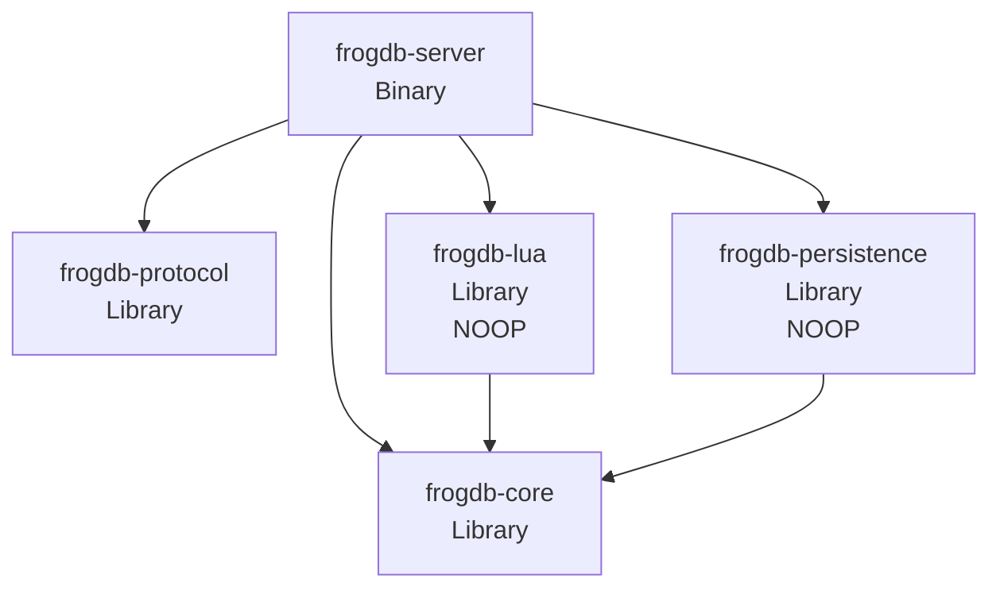
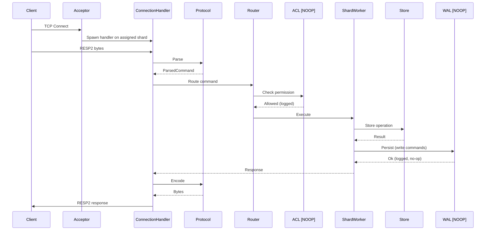
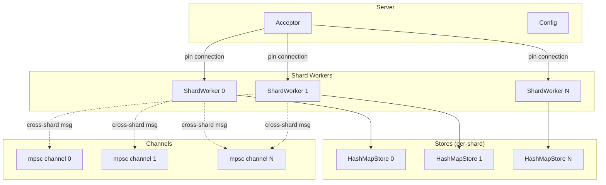
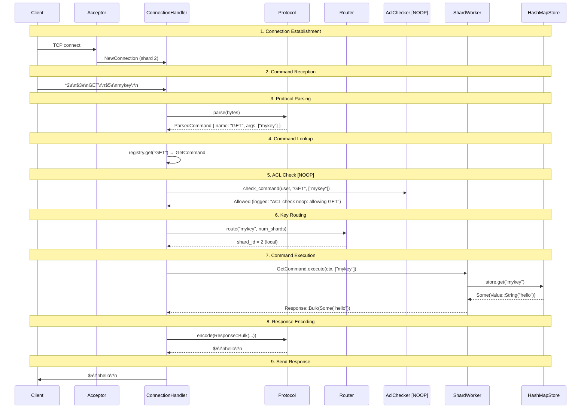

# FrogDB Software Architecture

This document describes FrogDB's software architecture: how components connect, interact, and divide responsibilities. For feature specifications and design rationale, see [INDEX.md](INDEX.md).

**Scope**: Phase 1 implementation with future components as NOOP stubs (log + passthrough).

---

## Table of Contents

1. [Overview](#overview)
2. [Design Principles](#design-principles)
3. [Crate Architecture](#crate-architecture)
4. [Component Relationships](#component-relationships)
5. [Responsibility Boundaries](#responsibility-boundaries)
6. [Data Flow](#data-flow)
7. [Future Components (NOOP)](#future-components-noop)
8. [Phase 1 Scope](#phase-1-scope)

---

## Overview

FrogDB is a Redis-compatible in-memory database written in Rust. The architecture emphasizes:

- **Shared-nothing threading**: Each shard worker owns its data exclusively
- **Message-passing**: Cross-shard coordination via channels, no shared state
- **Pin-based connections**: Connections assigned to a single shard worker for their lifetime
- **Clean crate boundaries**: Separate concerns across 5 crates

The system is designed so that future components (persistence, ACL, Lua scripting) can be added without refactoring the core architecture.

---

## Design Principles

### Shared-Nothing Threading

Each shard worker is a Tokio task that owns:
- A partition of the keyspace (determined by key hashing)
- Its own `Store` instance
- All connections pinned to it

No locks are needed for data access because each shard has exclusive ownership of its data.

### Message-Passing Over Shared State

Shard workers communicate via `mpsc` channels:
- `ShardMessage` for cross-shard requests (see [CONCURRENCY.md](CONCURRENCY.md#message-types) for full enum definition)
- `NewConnection` for connection assignment from the acceptor

This eliminates lock contention and simplifies reasoning about concurrency.

### Pin-Based Connections

When a client connects:
1. The Acceptor assigns it to a shard worker (round-robin)
2. The connection remains pinned to that shard for its lifetime
3. Commands for keys on other shards are forwarded via message-passing

### Key Hashing

FrogDB uses two hash algorithms for different purposes:

| Purpose | Algorithm | Range | Reference |
|---------|-----------|-------|-----------|
| Internal shard routing | xxhash64 | `hash % num_shards` | [CONCURRENCY.md](CONCURRENCY.md#key-hashing) |
| Cluster slot assignment | CRC16 | `hash % 16384` | [STORAGE.md](STORAGE.md#hash-algorithms) |

Both use the same hash tag extraction logic (`{tag}` syntax) for colocation.

### Separation of Concerns

Each crate has a clear, bounded responsibility:
- **Protocol**: Wire format only (no command semantics)
- **Core**: Data structures and command logic (no I/O)
- **Server**: I/O, concurrency, orchestration
- **Lua**: Script execution (NOOP in Phase 1)
- **Persistence**: Durability (NOOP in Phase 1)

---

## Crate Architecture

FrogDB is organized as a Cargo workspace with 5 crates:



### frogdb-protocol

**Responsibility**: RESP2 wire protocol parsing and encoding.

| Aspect | Details |
|--------|---------|
| **Owns** | Frame parsing, Response encoding, Tokio codec |
| **Does NOT own** | Command semantics, execution logic |
| **Key types** | `ParsedCommand { name: Bytes, args: Vec<Bytes> }`, `Response` ([enum definition](PROTOCOL.md#outbound-response--frame)), `ProtocolVersion` |
| **Dependencies** | `bytes`, `redis-protocol`, `tokio-util` |
| **Dependents** | `frogdb-server` |

### frogdb-core

**Responsibility**: Data structures, command trait, and command implementations.

| Aspect | Details |
|--------|---------|
| **Owns** | `Store` trait, `Value` enum, `Command` trait, command implementations |
| **Does NOT own** | I/O, networking, concurrency primitives |
| **Key types** | `Store` ([trait definition](STORAGE.md#store-trait)), `HashMapStore`, `Value`, `Command`, `CommandRegistry`, `CommandError` |
| **Dependencies** | `bytes`, `griddle` |
| **Dependents** | `frogdb-server`, `frogdb-lua`, `frogdb-persistence` |

### frogdb-lua (NOOP)

**Responsibility**: Lua script execution within shards.

| Aspect | Details |
|--------|---------|
| **Owns** | Lua VM pool, `redis.call()` bindings, script caching |
| **Does NOT own** | Key routing (scripts must use hash tags for colocation) |
| **Key types** | `LuaVmPool`, `ScriptRegistry` |
| **Dependencies** | `frogdb-core`, `mlua` (future) |
| **Dependents** | `frogdb-server` |
| **Phase 1 behavior** | Returns `NotImplemented` error, logs invocation |

### frogdb-persistence (NOOP)

**Responsibility**: Durable storage via RocksDB.

| Aspect | Details |
|--------|---------|
| **Owns** | WAL writing, snapshot management, crash recovery |
| **Does NOT own** | In-memory storage (that's `frogdb-core`) |
| **Key types** | `WalWriter`, `SnapshotManager`, `RocksDbBackend` |
| **Dependencies** | `frogdb-core`, `rocksdb` (future) |
| **Dependents** | `frogdb-server` |
| **Phase 1 behavior** | Returns `Ok(())`, logs invocation |

### frogdb-server

**Responsibility**: Main server binary, I/O, and concurrency orchestration.

| Aspect | Details |
|--------|---------|
| **Owns** | TCP acceptor, shard workers, connection handling, routing, configuration |
| **Does NOT own** | Protocol parsing (delegates to `frogdb-protocol`), command logic (delegates to `frogdb-core`) |
| **Key types** | `Server`, `Acceptor`, `ShardWorker`, `ConnectionHandler`, `Config` |
| **Dependencies** | All other crates, `tokio`, `figment`, `clap`, `tracing` |

---

## Component Relationships

### Request Flow



Commands execute with access to `CommandContext`, which provides store access, connection state, and shard routing. See [EXECUTION.md](EXECUTION.md#commandcontext-definition) for the complete definition.

### Shard Architecture



### Key Component Interactions

| Interaction | Description |
|-------------|-------------|
| **Acceptor → ShardWorker** | New connections sent via `NewConnection { socket, addr, conn_id }` struct |
| **ConnectionHandler → Protocol** | Parsing and encoding via `frogdb-protocol` types |
| **ConnectionHandler → Router** | Command routing based on key hashing |
| **Router → ACL** | Permission check before execution (NOOP: always allowed) |
| **ShardWorker → Store** | Data operations via `Store` trait |
| **ShardWorker → WAL** | Persistence hook for write commands (NOOP: log + skip) |
| **ShardWorker ↔ ShardWorker** | Cross-shard requests via `mpsc` channels |

---

## Responsibility Boundaries

### Protocol Crate Boundary

```
┌─────────────────────────────────────────────────────────┐
│                    frogdb-protocol                       │
├─────────────────────────────────────────────────────────┤
│  IN: Raw bytes from network                              │
│  OUT: ParsedCommand { name, args }                       │
│                                                          │
│  IN: Response enum                                       │
│  OUT: RESP2-encoded bytes                                │
├─────────────────────────────────────────────────────────┤
│  DOES NOT: Execute commands, access storage, route keys  │
└─────────────────────────────────────────────────────────┘
```

### Core Crate Boundary

```
┌─────────────────────────────────────────────────────────┐
│                      frogdb-core                         │
├─────────────────────────────────────────────────────────┤
│  IN: Command name, args, CommandContext                  │
│  OUT: Response (success or error)                        │
│                                                          │
│  Store trait: get, set, delete, contains, scan           │
│  Command trait: name, arity, flags, execute, keys        │
├─────────────────────────────────────────────────────────┤
│  DOES NOT: Network I/O, async operations, routing        │
└─────────────────────────────────────────────────────────┘
```

### Server Crate Boundary

```
┌─────────────────────────────────────────────────────────┐
│                     frogdb-server                        │
├─────────────────────────────────────────────────────────┤
│  OWNS:                                                   │
│    - TCP listener and connection lifecycle               │
│    - Shard worker tasks (one per core)                   │
│    - Key routing (hash slot → internal shard)            │
│    - Configuration loading (Figment: CLI > env > TOML)   │
│    - Graceful shutdown                                   │
├─────────────────────────────────────────────────────────┤
│  DELEGATES TO:                                           │
│    - frogdb-protocol: parsing/encoding                   │
│    - frogdb-core: command execution                      │
│    - frogdb-persistence: durability (NOOP)               │
│    - frogdb-lua: script execution (NOOP)                 │
└─────────────────────────────────────────────────────────┘
```

### Error Handling

Command errors are returned via `CommandError` enum (see [EXECUTION.md](EXECUTION.md#commanderror) for complete definition). Key variants:
- `WrongArity` - Incorrect number of arguments
- `WrongType` - Operation on wrong value type
- `InvalidArgument` - Invalid argument format
- `OutOfMemory` - maxmemory limit reached

> **Note:** Key routing is implemented as functions within the server crate, not as a separate `Router` struct. The routing logic uses hash functions defined in [CONCURRENCY.md](CONCURRENCY.md#key-hashing).

### NOOP Crate Boundaries

```
┌─────────────────────────────────────────────────────────┐
│              frogdb-persistence [NOOP]                   │
├─────────────────────────────────────────────────────────┤
│  WalWriter::write(entry) → log("WAL write noop") → Ok(())│
│  SnapshotManager::create() → log("snapshot noop") → Ok() │
│  Recovery::load() → log("recovery noop") → empty store   │
└─────────────────────────────────────────────────────────┘

┌─────────────────────────────────────────────────────────┐
│                  frogdb-lua [NOOP]                       │
├─────────────────────────────────────────────────────────┤
│  EVAL/EVALSHA → log("lua noop") → NotImplemented error   │
│  SCRIPT LOAD → log("lua noop") → NotImplemented error    │
└─────────────────────────────────────────────────────────┘
```

---

## Data Flow

### GET Command Walkthrough

This traces a `GET mykey` command through the entire system:



### SET Command Walkthrough (with NOOP persistence)

For write commands, the persistence hook is invoked but does nothing:

```
1. Client sends: SET mykey hello
2. Protocol parses to ParsedCommand
3. ACL check: log("ACL check noop: allowing SET") → Allowed
4. Router: shard_id = hash("mykey") % num_shards
5. SetCommand.execute():
   a. store.set("mykey", Value::String("hello"))
   b. wal_writer.write(SetEntry { key, value })
      → log("WAL write noop: SET mykey") → Ok(())
6. Response: +OK\r\n
```

### Cross-Shard Request Flow

When a command's key maps to a different shard:

```
1. Connection pinned to ShardWorker 0
2. Client sends: GET otherkey
3. Router: shard_id = 3 (remote)
4. ShardWorker 0 creates oneshot channel for response
5. ShardWorker 0 sends ShardMessage::Execute to ShardWorker 3
6. ShardWorker 3 executes, sends response via oneshot
7. ShardWorker 0 receives response, encodes, sends to client
```

---

## Future Components (NOOP)

Components that exist as stubs in Phase 1, ready for future implementation:

| Component | Crate | NOOP Behavior | Implemented In |
|-----------|-------|---------------|----------------|
| **AclChecker** | frogdb-server | Log + return `Allowed` | Phase 10 |
| **LuaVmPool** | frogdb-lua | Log + return `NotImplemented` error | Phase 8 |
| **WalWriter** | frogdb-persistence | Log + return `Ok(())` | Phase 5 |
| **SnapshotManager** | frogdb-persistence | Log + return `Ok(())` | Phase 5 |
| **RocksDbBackend** | frogdb-persistence | Log + return `Ok(())` | Phase 5 |
| **ReplicationTracker** | frogdb-server | Log + return `Ok(())` | Phase 14 |
| **Clustering** | frogdb-server | Not wired in | Phase 14 |
| **PubSub** | frogdb-server | Log + return error | Phase 7 |
| **BlockingCommands** | frogdb-core | Not implemented | Phase 11 |
| **NonStringTypes** | frogdb-core | Return `WRONGTYPE` error | Phase 2-6 |
| **Eviction** | frogdb-core | No-op (no memory limits) | Phase 10 |
| **VllCoordination** | frogdb-server | Single-shard only | Phase 4 |
| **ExpiryIndex** | frogdb-core | Empty struct, no-op methods | Phase 2 |
| **MetricsRecorder** | frogdb-server | Log + no-op | Phase 10 |
| **Tracer** | frogdb-server | Log + no-op span | Phase 10 |

### NOOP Implementation Pattern

All NOOP components follow this pattern:

```rust
// Example: AclChecker NOOP
pub struct AlwaysAllowAcl;

impl AclChecker for AlwaysAllowAcl {
    fn check_command(&self, user: &User, cmd: &str, keys: &[&[u8]]) -> AclResult {
        tracing::debug!(
            user = %user.name,
            command = cmd,
            "ACL check (noop): allowing"
        );
        AclResult::Allowed
    }
}

// Example: WalWriter NOOP
pub struct NoopWalWriter;

impl WalWriter for NoopWalWriter {
    fn write(&self, entry: &WalEntry) -> Result<(), PersistenceError> {
        tracing::debug!(?entry, "WAL write (noop): skipping");
        Ok(())
    }
}
```

Key aspects:
1. **Same interface** as the real implementation will have
2. **Logs the invocation** for debugging visibility
3. **Returns success** (or appropriate passthrough value)
4. **No side effects** (no actual persistence, no actual checks)

### NOOP Trait Interfaces

The following traits define the contracts that NOOP implementations must fulfill. These will be implemented fully in later phases.

#### AclChecker Trait

```rust
pub trait AclChecker: Send + Sync {
    /// Check if user has permission to execute command on given keys
    fn check_command(&self, user: &User, cmd: &str, keys: &[&[u8]]) -> AclResult;

    /// Check if user can access a specific key
    fn check_key(&self, user: &User, key: &[u8], access: KeyAccess) -> AclResult;

    /// Check if user can subscribe to a channel
    fn check_channel(&self, user: &User, channel: &[u8]) -> AclResult;
}

pub enum AclResult {
    Allowed,
    Denied { reason: &'static str },
}

pub enum KeyAccess {
    Read,
    Write,
}
```

#### WalWriter Trait

```rust
pub trait WalWriter: Send {
    /// Append a write operation to the WAL
    fn write(&mut self, entry: &WalEntry) -> Result<(), PersistenceError>;

    /// Flush pending writes to disk
    fn flush(&mut self) -> Result<(), PersistenceError>;

    /// Sync WAL to durable storage
    fn sync(&mut self) -> Result<(), PersistenceError>;
}

pub struct WalEntry {
    pub key: Bytes,
    pub operation: WalOperation,
    pub timestamp: u64,
}

pub enum WalOperation {
    Set(Bytes),
    Delete,
    Expire(u64),
}
```

#### SnapshotManager Trait

```rust
pub trait SnapshotManager: Send {
    /// Start a new snapshot
    fn start(&mut self) -> Result<SnapshotId, PersistenceError>;

    /// Write key-value batch to snapshot
    fn write_batch(&mut self, id: SnapshotId, batch: &[(Bytes, Value)]) -> Result<(), PersistenceError>;

    /// Finalize snapshot
    fn finish(&mut self, id: SnapshotId) -> Result<(), PersistenceError>;

    /// Abort snapshot
    fn abort(&mut self, id: SnapshotId) -> Result<(), PersistenceError>;
}
```

---

## Phase 1 Scope

What IS implemented in Phase 1:

### Implemented Components

| Component | Status | Notes |
|-----------|--------|-------|
| **RESP2 Protocol** | Full | Parse and encode all RESP2 types |
| **GET, SET, DEL** | Full | Basic string operations |
| **PING, ECHO, QUIT** | Full | Connection utilities |
| **EXISTS** | Full | Key existence check |
| **HashMapStore** | Full | In-memory storage via `griddle::HashMap` |
| **ShardWorker** | Full | Event loop, connection handling |
| **Key Routing** | Full | Hash tag support, shard assignment |
| **Configuration** | Full | Figment: CLI > env > TOML > defaults |
| **Logging** | Full | `tracing` with pretty/JSON formats |

### Not Implemented (NOOP)

- Persistence (WAL, snapshots, RocksDB)
- ACL (always allows)
- Lua scripting (returns error)
- Non-string data types
- TTL/expiry
- Multi-shard atomic operations
- Pub/Sub
- Metrics/tracing
- Replication/clustering

### Shard Configuration

Phase 1 supports multiple shards but:
- Cross-shard operations return `CROSSSLOT` error (unless same hash tag)
- VLL coordination is not implemented (single-shard atomicity only)

---

## References

- [INDEX.md](INDEX.md) - Design document (what the system does)
- [ROADMAP.md](ROADMAP.md) - Implementation phases and progress
- [CONCURRENCY.md](CONCURRENCY.md) - Threading model details
- [EXECUTION.md](EXECUTION.md) - Command execution flow
- [REPO.md](REPO.md) - Repository structure and build configuration
